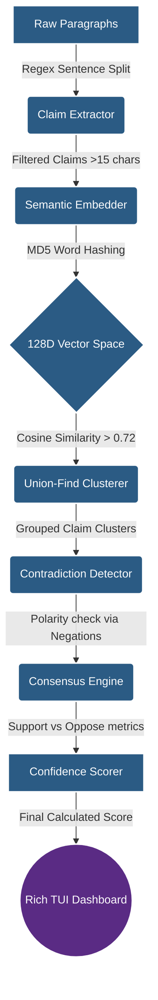

# 🧠 SourceSense

> **A tiny research lab running inside your terminal.** SourceSense is a lightweight, pure-Python reasoning pipeline and consensus engine. Think of it like a courtroom: every paragraph you feed it is a "witness," and the engine figures out who agrees with whom, detects contradictions, and calculates a final consensus—all without heavy machine learning dependencies.

Most AI student projects stop at a simple `prompt → LLM → answer` loop. SourceSense goes deeper, building a full algorithmic reasoning pipeline entirely from scratch.

## ✨ Key Features

- **Zero Heavy Dependencies:** Runs entirely on standard Python libraries. The only external requirement is `rich` for the gorgeous Terminal UI.
- **5 Built-in AI Techniques:** Claim extraction, semantic embeddings, clustering, contradiction detection, and consensus scoring.
- **Blazing Fast Execution:** Uses a custom md5-based word hashing algorithm for embeddings and a Union-Find data structure for clustering, eliminating the need for bulky vector databases or ML frameworks.

---

## 🏗️ System Architecture

SourceSense processes raw text through a multi-stage deterministic pipeline. Here is the data flow:



---

## 🔬 In-Depth Component Details

### 1. Claim Extractor (`claims/extractor.py`)

Instead of relying on an LLM to parse text, the system uses regular expressions to split raw paragraphs into distinct sentences, filtering out anything under 15 characters to ensure only substantial claims are processed.

### 2. Semantic Embeddings (`embeddings/embedder.py`)

**The Pure Python Magic:** Instead of loading a 4GB PyTorch model to generate embeddings, SourceSense uses a cheap, fast semantic approximation. By lowercasing text, splitting words, and hashing them using `hashlib.md5`, it projects words into a fixed 128-dimensional vector space.

- **Result:** A frequency map of hashed words that captures lexical similarity at lightning speed.

### 3. Clustering via Union-Find (`clustering/clusterer.py`)

Claims are grouped together if they are talking about the same thing. The engine computes the **Cosine Similarity** between two vectors. If the similarity exceeds the `SIM_THRESHOLD` (set to `0.72`), the system uses a highly efficient **Union-Find (Disjoint Set)** algorithm to group those claims into the same cluster.

### 4. Contradiction Detection (`consensus/contradiction_detector.py`)

Once grouped, the engine must figure out if the claims in a cluster are agreeing or arguing. It applies a rule-based polarity check, scanning for an array of negation keywords (`not`, `fails`, `false`, `unlikely`).

- No negations = Support `(+1)`
- Negations found = Oppose `(-1)`

### 5. Confidence Scoring (`scoring/confidence.py`)

The system calculates a final confidence metric using a weighted mathematical formula based on the ratio of supporting vs. opposing claims within a cluster:

$$Score = \max\left(0, \min\left(1, 0.7 \times \frac{S}{T} - 0.4 \times \frac{O}{T}\right)\right)$$

_(Where $S$ is Support, $O$ is Oppose, and $T$ is Total claims)_

---

## 🚀 Installation & Usage

**1. Clone the repository**

```bash
git clone https://github.com/yourusername/sourcesense.git
cd sourcesense

```

**2. Install the single UI dependency**

```bash
pip install rich

```

**3. Run the engine**

```bash
python main.py

```

### Example TUI Output

| Claim Example                       | Support | Oppose | Confidence |
| ----------------------------------- | ------- | ------ | ---------- |
| Rust prevents memory safety bugs    | 8       | 1      | 0.89       |
| Rust improves system reliability    | 5       | 0      | 1.00       |
| Rust does not eliminate memory bugs | 1       | 3      | 0.25       |

---

## 📂 Project Structure

```text
sourcesense/
├── core/
│   ├── pipeline.py            # Chains the engine components
│   └── orchestrator.py        # Main entry point handler
├── claims/
│   ├── extractor.py           # Regex-based sentence parsing
│   └── claim.py               # Data class for Claim objects
├── embeddings/
│   ├── embedder.py            # MD5 128D vector hashing
│   └── similarity.py          # Cosine similarity math
├── clustering/
│   ├── clusterer.py           # Groups similar vectors
│   └── union_find.py          # Disjoint-set data structure
├── consensus/
│   ├── consensus_engine.py    # Tallies cluster metrics
│   └── contradiction_detector.py # Polarity / negation mapping
├── scoring/
│   └── confidence.py          # Confidence score formula
├── tui/
│   ├── dashboard.py           # Rich library Table output
│   └── progress.py            # Rich library Loading bars
├── utils/
│   └── text.py                # Text normalization helpers
└── main.py                    # Execution script

```

---

## 🔮 Roadmap: What's Next?

SourceSense is designed to be highly extensible. Planned upcoming features include:

1. **Research Knowledge Graph:** Exporting relationships into a directed graph format (e.g., `claim1 → supports → claim2`, `claim3 → contradicts → claim1`).
2. **Custom Fast Vector Indexing:** Implementing a pure-Python indexing trick to allow the engine to process 500+ source documents in under 2 seconds without relying on FAISS or scikit-learn.
